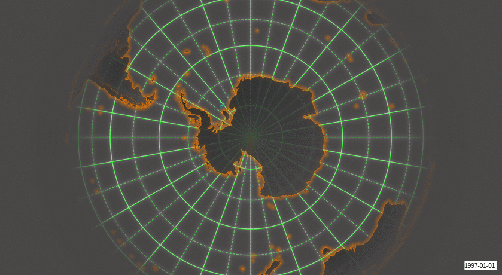
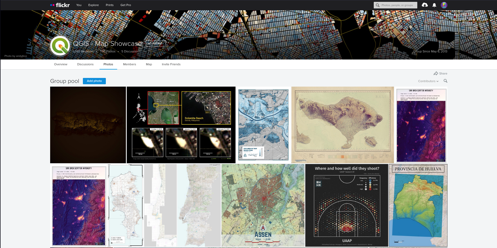
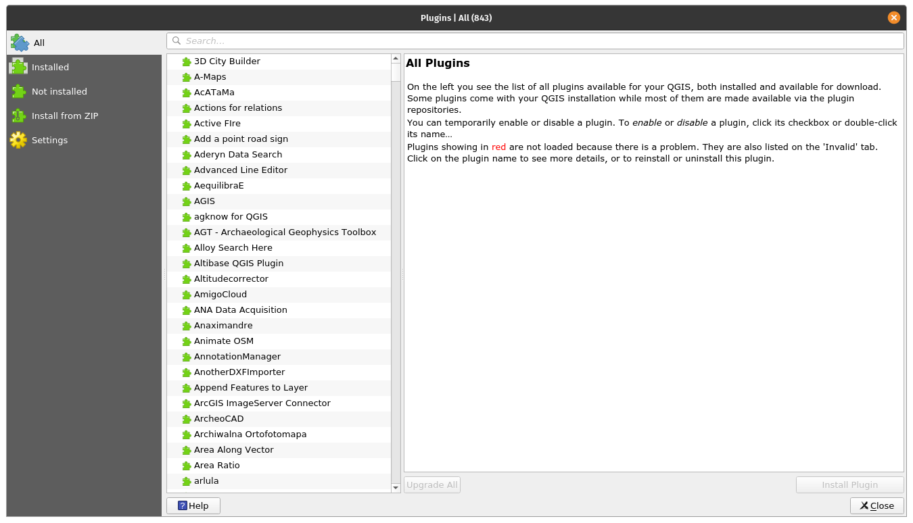

# About QGIS

*Note: This is an in-progress draft. Formatting, especially images, will be improved once feedback on structure and main text is received.*

QGIS is a full-featured, user-friendly, free-and-open-source (FOSS) geographical 
information system (GIS) that runs on Unix platforms, Windows, and MacOS.

## Features 

### 1. Flexible and powerful spatial data management

- Supports raster, vector, mesh, and point cloud data in a range of industry-standard formats
    - *Raster formats include:* GeoPackage, GeoTIFF, GRASS, ArcInfo binary and ASCII grids, ERDAS Imagine SDTS, WMS, WCS, PostgreSQL/PostGIS, and [other GDAL supported formats](https://gdal.org/drivers/raster/index.html).
    - *Vector formats include:* GeoPackage, ESRI Shapefiles, GRASS, SpatiaLite, PostgreSQL/PostGIS, MSSQL, Oracle, WFS, Vector Tiles and [other OGR supported formats](http://www.gdal.org/ogr_formats.html). 
    - *Mesh formats include*: NetCDF, GRIB, 2DM, and [other MDAL supported formats](https://github.com/lutraconsulting/MDAL#supported-formats).
    - *Point-cloud format*: LAS/LAZ and EPT datasets.
- Access and display local files, spatial databases (PostGIS, SpatiaLite, MSSQL, SAP HANA), web services (WMS, WCS, WFS, ArcGIS REST services), tile services, etc.
<!-- removed DB2 due to https://github.com/qgis/QGIS/pull/41178 -->
- Visual and numerical digitizing and editing
- On-the-fly reprojection between coordinate reference systems (CRS)
- Temporal support

### 2. Beautiful cartography
- Large variety of rendering options in 2D and 3D
- Fine control over symbology, labeling, legends and additional graphical elements for beautifully rendered maps
- Advanced styling using data-defined overrides, blending modes, and draw effects
- 500+ built-in color ramps (cpt-city, ColorBrewer, etc.) 
- Create and update maps with specified scale, extent, style, and decorations via saved layouts
- Generate multiple maps (and reports) automatically using QGIS Atlas and QGIS Reports
- Flexible output direct to printer, or as image (raster), PDF, or SVG for further customization 
- On-the-fly rendering enhancements using geometry generators (e.g. create and style new geometries from existing features)
- Preview modes for inclusive map making (e.g. monochrome, color blindness)

[Example: Map of Bogota, Columbia in the style of Starry Starry Night, by Andrés Felipe Lancheros Sánchez](https://flic.kr/p/2jFfGJP)

For more maps created with QGIS, visit the [QGIS Map Showcase Flickr Group](https://www.flickr.com/groups/2244553@N22/pool/with/50355460063/).

### 3. Advanced and robust geospatial analysis
- Powerful processing framework with 200+ native processing algorithms
- Access to 1000+ processing algorithms via providers such as GDAL, SAGA, GRASS, OrfeoToolbox, as well as custom models and processing scripts
- Geospatial database engine (filters, joins, relations, forms, etc.), as close to datasource- and format-independent as possible 
- Immediate visualization of geospatial query and geoprocessing results
- Graphical modeler and batch processing

Example: Travel isochrones

Example: Graphical model

### 4. Powerful customization and extensibility

- Fully customizable user experience, including user interface and application settings that cater to power-users and beginners alike
- Rich [expression engine](https://docs.qgis.org/testing/en/docs/user_manual/working_with_vector/expression.html) for maximum flexibility in visualization and processing
- Broad and varied [plugin ecosystem](https://plugins.qgis.org/) that includes data connectors, digitizing aids, advanced analysis and charting tools, in-the-field data capture, etc.
- Style manager for creating, storing, and managing styles
- [QGIS style hub](https://plugins.qgis.org/styles/) for easy sharing of styles
- Python and C++ API for standalone (headless) applications as well as in-application comprehensive scripting (PyQGIS)

Example: Style manager

Example: Plugins

<!-- Kill this one for now, since it's Python2 not 3
Example: Python console

-->

### 5. QGIS server

Headless map server -- running on Linux, macOS, Windows, or in a docker container -- that shares the same code base as QGIS.

- Industry-standard protocols (WMS, WFS, WFS3/OGC API for Features and WCS) allow plug-n-play with any software stack
- Works with any web server (Apache, nginx, etc) or standalone
- All QGIS beautiful cartography is supported with best-in-class support for printing
- Fully customizable with Python scripting support

Example: QGIS server WMS response

Example: QGIS server WFS response

## Under the hood

QGIS is developed using the [Qt toolkit](https://qt.io) and C++, since 2002, and has a pleasing, easy to use graphical
user interface with multilingual support. It is maintained by an active developer team and supported by vibrant 
community of GIS professionals and enthusiasts as well as geospatial data publishers and end-users. 

### Versions and release cycle

QGIS development and releases follow a [time based schedule/roadmap](https://www.qgis.org/en/site/getinvolved/development/roadmap.html). There are three main branches of QGIS that users can install. These are the **Long Term Release (LTR)** branch, **Latest Release (LR)** branch, and the **Development (Nightly)** branch. 

Every month, there is a **Point Release** that provides bug-fixes to the LTR and bug-fixes as well as new features to the LR.

### Free and Open Source

QGIS is released under the GNU Public License (GPL) Version 2 or above.
Developing QGIS under this license means that you can (if you want to) inspect
and modify the source code and guarantees that you, our happy user will always
have access to a GIS program that is free of cost and can be freely
modified.

QGIS is part of the Open-Source Geospatial Foundation ([OSGeo](https://www.osgeo.org/)), offering a range of complementary open-source GIS software projects.

## Installing and using QGIS

Precompiled binaries for QGIS are available at [the QGIS.org download page](https://www.qgis.org/en/site/forusers/download.html).
Please follow the installation instructions carefully.

The [building guide](INSTALL.md) can be used to get started with building QGIS from source.

For installation of QGIS Server, see its [getting started documentation](https://docs.qgis.org/testing/en/docs/server_manual/getting_started.html).

### Documentation

A range of 
[documentation](https://qgis.org/en/docs/index.html) is available. This includes

- [Training Manual](https://docs.qgis.org/latest/en/docs/training_manual/index.html)
- [QGIS User Guide](https://docs.qgis.org/latest/en/docs/user_manual/index.html)
- [QGIS Server Guide](https://docs.qgis.org/latest/en/docs/server_manual/index.html)
- [Documentation Guidelines](https://docs.qgis.org/latest/en/docs/documentation_guidelines/index.html)
- [PyQGIS Cookbook](https://docs.qgis.org/latest/en/docs/pyqgis_developer_cookbook/index.html)
- [Developers Guide](https://docs.qgis.org/latest/en/docs/developers_guide/index.html)
- [Visual Changelog](https://qgis.org/en/site/forusers/visualchangelogs.html)

### Help and Support Channels

There are several channels where you can find help and support for QGIS:

- Using the QGIS community site at [https://qgis.org](https://qgis.org)
- Joining the [qgis-users mailing list](https://lists.osgeo.org/mailman/listinfo/qgis-user)
- Chatting with other usesrs real-time. *Please wait around for a response to your question as many folks on the channel are doing other things and it may take a while for them to notice your question. The following paths all take you to the same chat room:*
    - Using an IRC client and joining the [#qgis](http://webchat.freenode.net/?channels=#qgis) channel on irc.freenode.net.
    - Using a Matrix client and joining the [#qgis:matrix.org](http://matrix.to/#/#qgis:matrix.org) room.
    - Using [Gitter](https://gitter.im/qgis/QGIS?utm_source=badge&utm_medium=badge&utm_campaign=pr-badge&utm_content=badge) chat.
 - At the [GIS stackexchange](https://gis.stackexchange.com/) or [r/QGIS reddit](https://www.reddit.com/r/QGIS/), which are not maintained by the QGIS team, but where the QGIS and broader GIS community provides lots of advice
- [Other support channels](https://qgis.org/en/site/forusers/support.html)

## Get involved with the community

Please **help us by submitting bug reports** using the [QGIS bug tracker](https://github.com/qgis/QGIS/issues/).

### New features and enhahncements

If you wish to contribute
patches you can [fork the project](https://help.github.com/forking/), make your changes, commit to your
repository, and then [create a pull request](https://help.github.com/articles/creating-a-pull-request-from-a-fork/). The development team can then review your contribution and commit it upstream as appropriate.

If you commit a new feature, add [FEATURE] to your commit message AND give a clear description of the new feature. A webhook will automatically create an issue on the QGIS-Documentation repo to tell people to write documentation about it.

For large-scale changes, you can open a [QEP (QGIS Enhancement Proposal)](https://github.com/qgis/QGIS-Enhancement-Proposals). QEPs are used in the process of creating and discussing new enhancements or policy for QGIS. 

### Translations

Please help translate QGIS to your language. At this moment about forty languages are already available in the Desktop user interface and about eighty languages are available in transifex ready to be translated.

The [translation](https://qgis.org/en/site/getinvolved/translate.html) process is managed by the [Translation Team](https://qgis.org/en/site/getinvolved/governance/governance.html#gui-translation) and all the activities are done under the [Transifex](https://www.transifex.com/) platform.

### Other ways to contribute

If you are not a developer, there are many other possibilities which do not require programming skills to help QGIS to evolve. Check our [project homepage for more information](http://qgis.org/en/site/getinvolved/index.html).
